

# Simple Swerve

### A compact differential swerve platform for FIRST Tech Challenge robots

[Watch the videos](#videos) · [Download the CAD](#cad-downloads) · [Read the design story](#design-story) · [View the license](LICENSE)

  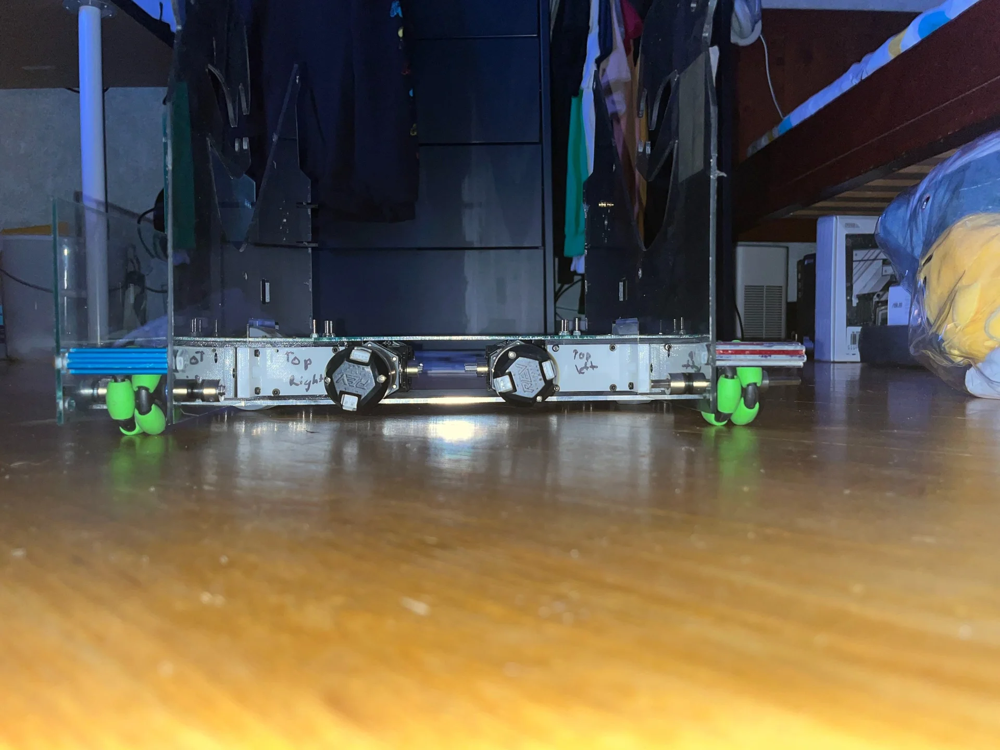

---

## Overview

Simple Swerve is a differential swerve drivetrain developed for the FIRST Tech Challenge. The project began after the 2023–2024 New York–NYC FTC Championship, when an upcoming offseason event created an opportunity to try a drivetrain rarely seen in FTC.

Swerve drive combines omnidirectional movement with the traction of conventional wheels. Unlike Mecanum and omni wheel drivetrains, it does not depend on low traction rollers to move sideways. Each wheel module can point in a chosen direction while continuing to drive, allowing the robot to accelerate, translate, and stop without intentionally giving up wheel contact area.

> [!IMPORTANT]
> **This project is complete.** The complete CAD exports, project explanation, and development images are stored in this repository. No external project page or CAD host is required.

## Videos

These two demonstrations document the early Simple Swerve prototype and the later FTC sized version. Click either locally hosted preview to watch the full video on YouTube.

| First prototype — March 4, 2024 | FTC sized version — March 20, 2024 |
| :--: | :--: |
| [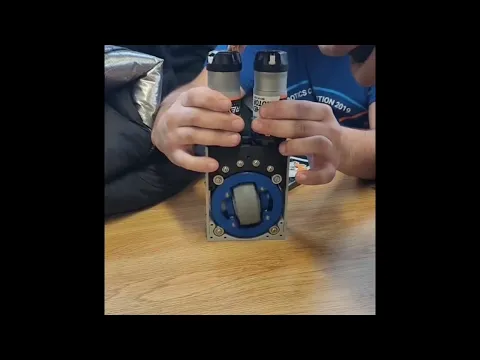](https://www.youtube.com/watch?v=7rm5lNFZ9ew) | [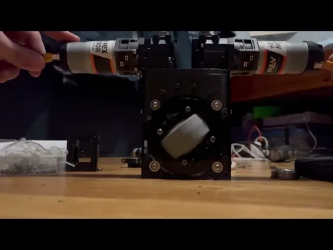](https://www.youtube.com/watch?v=EeESId9w0uI) |
| **[Watch “FTC Legal Differential Swerve — Simple Swerve”](https://www.youtube.com/watch?v=7rm5lNFZ9ew)** | **[Watch “FTC Legal Differential Swerve — Simple Swerve”](https://www.youtube.com/watch?v=EeESId9w0uI)** |

## CAD downloads

These ZIP files are the original exported release packages. Each archive contains its STEP files, part folders, and release renders.

| Release | Configuration | Files | Size | Download |
| :-- | :-- | --: | --: | :--: |
| **Simple Swerve V1** | FTC sized pod with 90° REV motor packaging | 19 | 62.6 MiB | **[Download ZIP](cad/releases/simple-swerve-v1.zip)** |
| **Simple Swerve V2 — REV** | Compact pod for two REV motors | 18 | 7.1 MiB | **[Download ZIP](cad/releases/simple-swerve-v2-rev.zip)** |
| **Simple Swerve V2 Chassis** | Complete V2 two pod chassis assembly | 10 | 236.3 MiB | **[Download ZIP](cad/releases/simple-swerve-v2-chassis.zip)** |
| **Simple Swerve V2 — goBILDA** | Compact pod for two goBILDA Yellow Jacket 8 mm REX motors | 19 | 36.1 MiB | **[Download ZIP](cad/releases/simple-swerve-v2-gobilda.zip)** |

Checksums and archive details are available in the **[CAD release index](cad/README.md)**. The release archives use Git LFS because the chassis package exceeds GitHub's standard per file limit.

## Design story

### Why differential swerve?

There are two common ways to build a swerve module:

- **Coaxial swerve** uses one motor to drive the wheel and a separate actuator—often a servo in FTC—to steer it.
- **Differential swerve** uses two motors together. Their combined motion drives the wheel, while the difference between their motion rotates the module.

Coaxial modules are mechanically straightforward but can require many small custom parts and an additional steering actuator for every module. Differential swerve reduces that actuator count, but demands a circular wheel pod, gears that mesh with the pod, and more complicated control software. Without absolute steering feedback, determining the direction of every module becomes especially difficult.

Simple Swerve takes the differential approach and focuses on simplifying its most difficult mechanical element: the gearbox.

### Simple Swerve prototype

The prototype revisited a differential swerve layout originally explored by FTC Team 11115, Gluten Free. The earlier design used set screws on printed gears along with older shafts and motors. Simple Swerve retained the general motor, wheel, and idler mounting positions while redesigning the gearbox to be less expensive and easier to reproduce.

Instead of D bore shafts holding the gears straight, the redesigned gearbox uses M3 × 45 mm bolts with bearings embedded directly in the printed gears.

  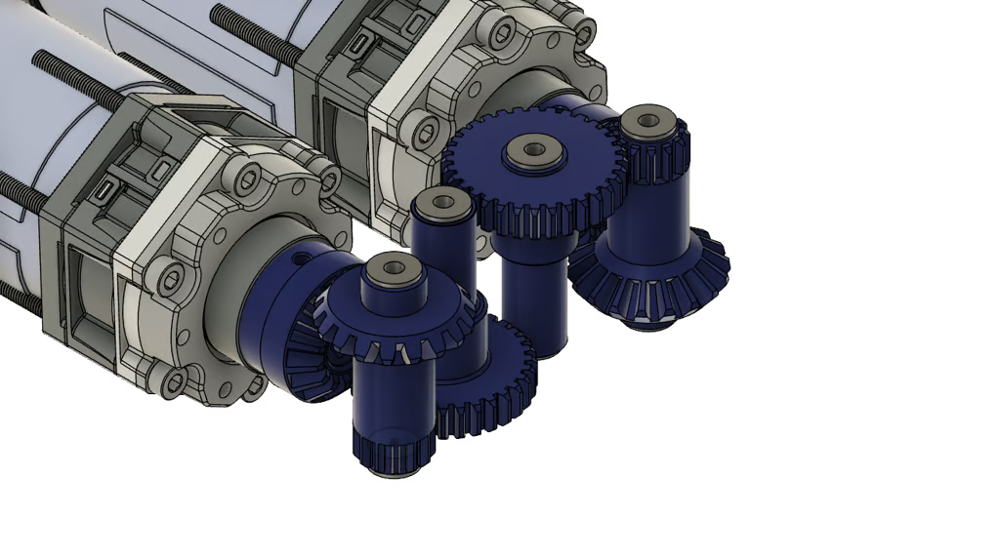
  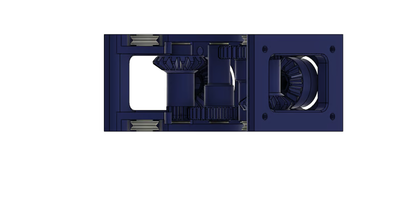

  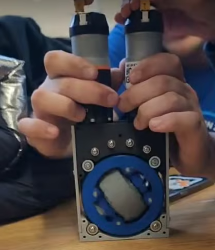

### Simple Swerve V1

The prototype modules were too long to place side by side in an FTC legal robot. With wiring, the pair measured approximately 18.25 inches, while the robot had to begin within an 18 × 18 × 18 inch volume.

V1 rotated the motors 90° by using REV UltraPlanetary right angle gearboxes. This allowed the modules to fit inside an FTC sized chassis while changing only the gearbox frame. The tradeoff was another bevel gear stage, which added mechanical complexity and reduced efficiency.

  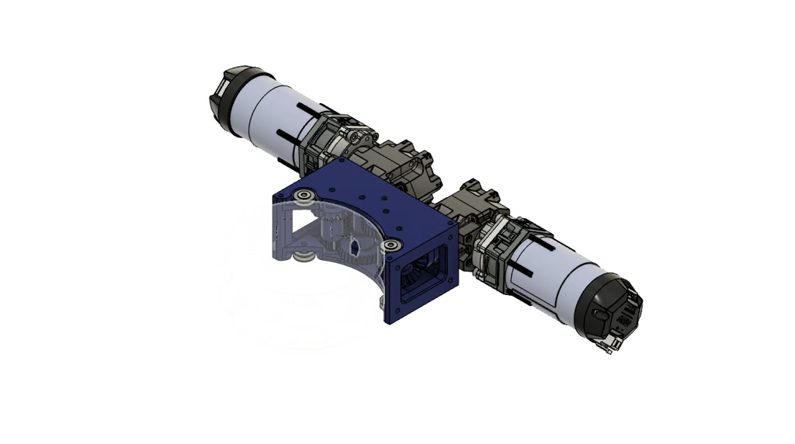
  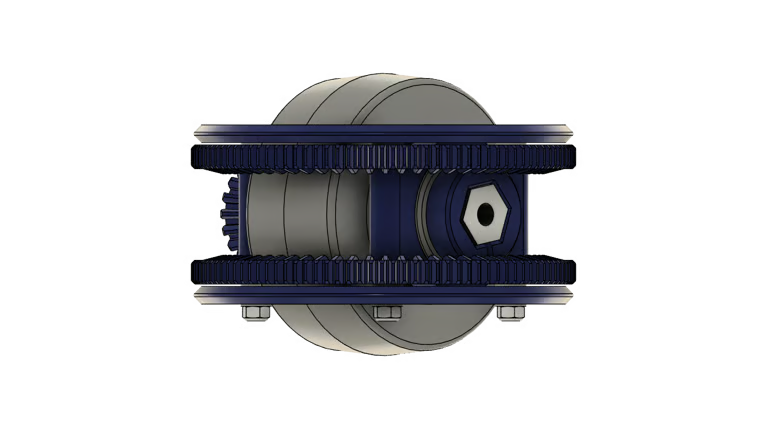

### Simple Swerve chassis

The first chassis used two swerve pods for powered movement and four omni wheels at the corners for stability. Cutouts were added for linear slides so the platform could carry an offseason scoring mechanism. The event was later canceled, and the chassis was never used in competition.

  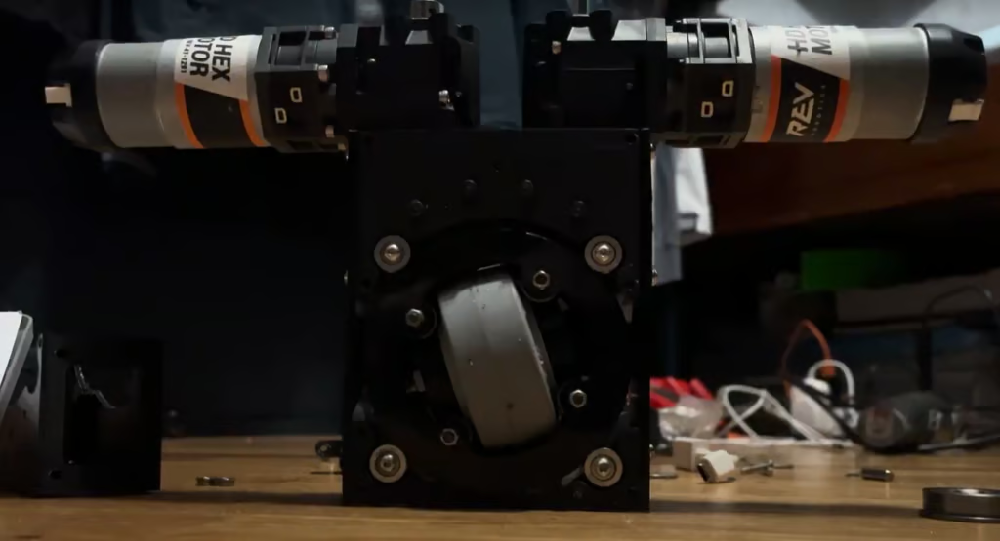
  

### Simple Swerve V2

V2 reduced the bill of materials and introduced two configurations. One accepts two REV motors; the other accepts two goBILDA Yellow Jacket 8 mm REX motors. The REV configuration eliminates the UltraPlanetary gearboxes, producing a smaller module while retaining the same internal components.

Only the gearbox casing and the two side, top, and bottom plates changed for the new package.

  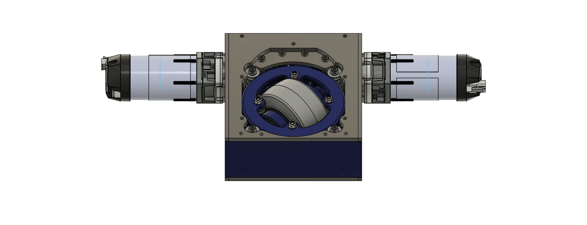
  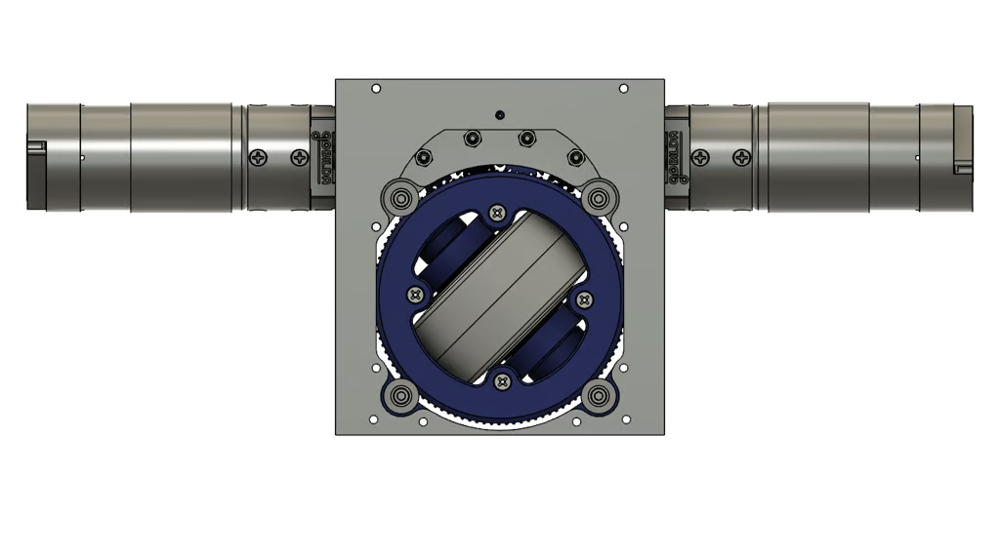

## Project status

**Simple Swerve is complete.** All four mechanical releases are preserved here as build resources and as a reference for teams exploring compact differential swerve in FTC.

This repository does not claim that the chassis competed or that the design is a drop-in competition solution. Builders should validate dimensions, tolerances, gearing, material choices, motor loads, and current FTC rules before manufacturing or competing with any version.

## Attribution and license

© 2026 Angelo James. The original Simple Swerve designs, renders, photographs, and documentation in this repository are licensed under the **[Creative Commons Attribution 4.0 International License](LICENSE)**.

You may build, modify, and share the design—including commercially—provided that you credit the creator, link to the license, and identify your changes. A suitable credit line is:

> **Simple Swerve by Angelo James — https://github.com/AloeVeraZ/diffy swerve — licensed under CC BY 4.0.**

## Acknowledgments

The prototype was inspired by the differential swerve work of **FTC Team 11115, Gluten Free**. Simple Swerve revisited that concept with updated motors, shafts, printed gearing, and a focus on affordability and reproducibility.

---

Designed by **Angelo James**

*This independent project is not endorsed by FIRST® or by the component manufacturers referenced above.*

